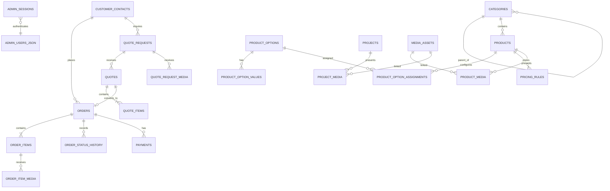

# Motion database schema

The SQL migrations in `db/migrations` are the source of truth. They use UUID primary keys, foreign keys, checks, indexes, `created_at`, and update triggers. Monetary values use `numeric(14,2)` and default to `UGX`; no binary data is stored in Postgres.

Migrations **0001–0014 are immutable**. `0015_neon_guest_admin.sql` adds guest contacts and administrator sessions, backfills `contact_id` from existing snapshots without rewriting those snapshots, and disables the Supabase Data API RLS configuration from 0014. `user_profiles` and legacy `customer_id` columns remain for rollback; application code must not read or write them.

`customer_contacts` are operational records, not accounts. There are no customer credentials, sessions, or login identifiers. Email is contact information only. Checkout and inquiry upsert by normalized email.

Administrator identity lives in server-only `ADMIN_USERS_JSON`. `admin_sessions` stores SHA-256 hashes of opaque bearer tokens. `admin_login_attempts` is keyed by the SHA-256 of the normalized username. Application code uses `actorId` (the stable administrator UUID) when writing existing `*_auth_user_id` audit columns.

Products use normalized `product_options`, `product_option_values`, and assignments; `pricing_rules.conditions` provides a constrained extension point for a later pricing engine. Orders snapshot titles/configurations, preserving production history if a catalogue product changes. Quotes can become an order through `orders.quote_id`.

Media metadata is centralized in `media_assets`, while explicit linking tables preserve referential integrity for products, projects, order items, and quote requests. Object keys are opaque; private files must be served only through an authorized, short-lived URL from the server adapter. This phase returns `storage_not_configured` rather than pretending uploads succeeded.

## ERD

`ADMIN_USERS_JSON` is configuration, not a table. `admin_sessions.administrator_id` stores that UUID.

## Administrator credentials

1. Generate a scrypt hash with `node scripts/hash-admin-password.js` (hidden prompt, never an argument).
2. Put one or more distinct administrators in `ADMIN_USERS_JSON` on the API service.
3. Sign in at `/manager` with username and password. The API issues an opaque session token; only its hash is stored.

No password, connection string, or administrator hash is stored in source control.
