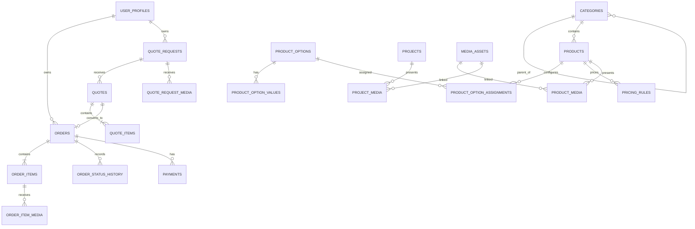

# Motion database schema

The SQL migrations in `db/migrations` are the source of truth. They use UUID primary keys, foreign keys, checks, indexes, `created_at`, and update triggers. Monetary values use `numeric(14,2)` and default to `UGX`; no binary data is stored in Postgres.

`user_profiles.auth_user_id` is the Neon Auth identity reference. It deliberately stores no credential, password, token, or session data. The identity is verified by the server before a profile is created or used.

Products use normalized `product_options`, `product_option_values`, and assignments; `pricing_rules.conditions` provides a constrained extension point for a later pricing engine. Orders snapshot titles/configurations, preserving production history if a catalogue product changes. Quotes can become an order through `orders.quote_id`.

Media metadata is centralized in `media_assets`, while explicit linking tables preserve referential integrity for products, projects, order items, and quote requests. Object keys are opaque; private files must be served only through an authorized, short-lived URL from the server adapter.

## ERD

## Admin bootstrap

1. Enable Neon Auth and create/sign in with the intended owner identity.
2. Create its normal customer profile through `POST /api/me`.
3. From the Neon SQL editor using an owner-controlled connection, run an audited update for that identity: `UPDATE public.user_profiles SET role = 'admin' WHERE auth_user_id = '<Neon Auth UUID>';`.
4. Confirm the user can access an admin API endpoint, and record the change in your operational log.

No password, service key, or administrator bootstrap token is stored in source control.
